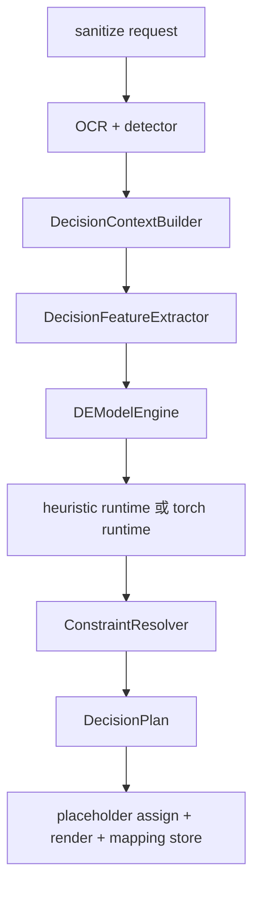

# de_model Implementation Notes

这份文档描述的是仓库里“当前已经实现出来的 `de_model`”，不是理想设计稿。

重点回答四个问题：

1. `de_model` 在主流程里已经接到了哪里
2. 目前到底有哪些组件已经实现
3. `TinyPolicyNet` 的模型层、输入和输出长什么样
4. 训练、推理、约束和回退现在分别做到了什么程度

## 1. 当前 `de_model` 在系统里的位置

`de_model` 已经是 `sanitize` 主流程里的正式决策模式，不再是旁路实验代码。

主链路如下：



当前 `sanitize` 的调用顺序是：

1. OCR 提取 `ocr_blocks`
2. detector 产出 `PIICandidate`
3. `DecisionContextBuilder` 构造统一的 `DecisionContext`
4. `DecisionEngine.plan(context)` 调用当前决策引擎
5. runtime 产出 `DEModelRuntimeOutput`
6. engine 把 runtime 输出转成 `DecisionAction`
7. `ConstraintResolver` 做合法性修正和降级
8. 后续再进入 placeholder 分配、文本/截图渲染、mapping 存储

## 2. 当前已经实现的部分

### 2.1 决策接口层

`DecisionEngine` 现在已经统一为单一上下文输入：

- `plan(context)`

这意味着：

- `label_only` 和 `label_persona_mixed` 也收到完整上下文，但只读取自己关心的字段；
- `de_model` 可以直接消费 prompt、OCR、history、persona、protection level 等完整信号；
- `sanitize_pipeline` 不再需要根据 engine 类型做双分支分派。

### 2.2 上下文构造

`DecisionContextBuilder` 已经把以下信息统一收敛到 `DecisionContext`：

- 当前轮 prompt 文本
- 当前 detector `protection_level`
- 当前 detector overrides
- OCR blocks
- detector 产出的 PII candidates
- 当前 session binding
- 当前 session 的历史替换记录
- persona repository 中的 persona profiles
- page 级特征
- candidate 级特征
- persona 级特征

#### Page 级特征

当前 page 特征共 20 维，除了原有摘要外，还补进了 detector/OCR 汇总信号：

1. `prompt_length`
2. `ocr_block_count`
3. `candidate_count`
4. `unique_attr_count`
5. `history_record_count`
6. `active_persona_bound`
7. `prompt_has_digits`
8. `prompt_has_address_tokens`
9. `average_candidate_confidence`
10. `min_candidate_confidence`
11. `high_confidence_candidate_ratio`
12. `low_confidence_candidate_ratio`
13. `prompt_candidate_count`
14. `ocr_candidate_count`
15. `average_ocr_block_score`
16. `min_ocr_block_score`
17. `low_confidence_ocr_block_ratio`
18. `protection_level_weak`
19. `protection_level_balanced`
20. `protection_level_strong`

#### Candidate 级特征

每个 candidate 会提取：

- 基本属性：`candidate_id / text / normalized_text / attr_type / source / confidence`
- 定位信息：`bbox / block_id / span_start / span_end`
- 局部文本窗口：`prompt_context / ocr_context`
- 历史统计：`history_attr_exposure_count / history_exact_match_count`
- 页内统计：`same_attr_page_count / same_text_page_count`
- 几何特征：`relative_area / aspect_ratio / center_x / center_y`
- OCR 局部质量：`ocr_block_score / ocr_block_rotation_degrees / is_low_ocr_confidence`
- 来源标记：`is_prompt_source / is_ocr_source`

#### Persona 级特征

每个 persona 会提取：

- `persona_id / display_name`
- `slot_count`
- `exposure_count`
- `last_exposed_session_id / last_exposed_turn_id`
- `is_active`
- `supported_attr_types`
- `matched_candidate_attr_count`
- `slots`

### 2.3 数值特征压缩

`DecisionFeatureExtractor` 已实现 page / candidate / persona 三层向量化。

当前默认维度：

| 向量 | 维度 | 说明 |
| --- | ---: | --- |
| `page_vector` | 20 | page 级归一化统计 + protection level + detector/OCR 汇总信号 |
| `candidate_vector` | 40 | attr/source/confidence/history/geometry/OCR 局部质量/text signature |
| `persona_vector` | 25 | slot/exposure/active/match/attr coverage/text signature |

#### Candidate 向量 37 维组成

`candidate_vector` 的结构是：

1. `attr_one_hot`
   当前覆盖完整 `PIIAttributeType`，共 11 维
2. `source_one_hot`
   `prompt / ocr`，共 2 维
3. `confidence`
   1 维
4. 历史与页内计数特征
   4 维
5. 几何特征
   4 维
6. 文本签名
   `text / prompt_context / ocr_context` 各 5 维，共 15 维

公式如下：

```text
11 + 2 + 1 + 4 + 4 + 15 = 37
```

#### Persona 向量 25 维组成

`persona_vector` 的结构是：

1. `slot_count / exposure_count / is_active / matched_candidate_attr_count`
   4 维
2. `supported_attr_types` one-hot
   11 维
3. `display_name` 文本签名
   5 维
4. `slots` 拼接文本签名
   5 维

公式如下：

```text
4 + 11 + 5 + 5 = 25
```

### 2.4 Runtime 层

当前 runtime 层已经抽成统一协议 `DecisionPolicyRuntime`，并且有两条实现路径：

1. `TinyPolicyRuntime`
   启发式 runtime
2. `TorchTinyPolicyRuntime`
   真实 `TinyPolicyNet` checkpoint 推理 runtime

还预留了：

3. `bundle` runtime
   目标是 ONNX/TFLite/移动端 bundle，但目前未实现

#### Heuristic runtime

`TinyPolicyRuntime` 已实现：

- persona 选择
- `KEEP / GENERICIZE / PERSONA_SLOT` 三类动作打分
- per-candidate 评分解释字符串

它用到的信号包括：

- candidate confidence
- history exposure
- history exact match
- same attr / same text page count
- page 是否有数字偏置
- 当前 active persona
- persona 是否支持该 attr
- OCR 来源与否

#### Torch runtime

`TorchTinyPolicyRuntime` 已实现：

- checkpoint 加载
- `TinyPolicyBatchBuilder` 构 batch
- `TinyPolicyNet.forward()`
- `TinyPolicyOutputDecoder` 解码成统一 runtime 输出

它已经可以直接消费：

- 只含 `state_dict` 的 checkpoint
- 或 `{state_dict, model_config}` 结构的 checkpoint

### 2.5 Decoder 层

`TinyPolicyOutputDecoder` 现在是独立层，不再混在 runtime 里。

它负责三件事：

1. persona logits -> `persona_scores` -> `active_persona_id`
2. action logits -> action probabilities -> `preferred_action`
3. 应用解码策略

当前支持的解码策略参数：

- `keep_threshold`
  低于该 confidence 时强制回退 `KEEP`
- `persona_score_threshold`
  persona 分数不达阈值则不激活 persona
- `action_tie_tolerance`
  action 分数足够接近时触发 tie-break

当前 tie-break 优先级是：

```text
KEEP < GENERICIZE < PERSONA_SLOT
```

也就是说如果多个动作分数几乎相同，当前会偏向更强匿名化动作。

### 2.6 约束解析层

runtime 输出不会直接写进渲染层，中间还有 `ConstraintResolver`。

它负责保证：

- candidate 不存在时降级为 `KEEP`
- 跨槽位替换时强制改为同槽位 `GENERICIZE`
- `PERSONA_SLOT` 但没有 active persona 时降级
- persona 没有对应 slot value 时降级
- `GENERICIZE` 缺失替换文本时自动补标准标签
- 非法动作统一降级 `KEEP`

这层的意义是：

- 模型可以学“偏好”
- 但业务合法性和可恢复性必须由约束层兜底

### 2.7 训练侧最小闭环

现在训练侧已经不只是目录骨架了。

当前已经实现：

1. `pack_training_turn()`
   把运行时 context 打成训练样本
2. `plan_to_supervision()`
   把运行时 `DecisionPlan` 变成 supervised 标签
3. `build_supervised_jsonl_dataset()`
   导出带标签 JSONL
4. `TinyPolicyBatchBuilder.build_examples()`
   从序列化样本重建 `TinyPolicyBatch`
5. `run_supervised_finetune()`
   读取 JSONL，做最小行为克隆训练
6. 导出 `tiny_policy_supervised.pt`
   可直接被 `TorchTinyPolicyRuntime` 加载

当前 supervised 训练目标：

- action head 交叉熵
- persona selector 交叉熵

当前还没有实现：

- adversarial finetune
- policy gradient / RL
- 系统化评估脚本
- bundle 导出到 ONNX/TFLite

## 3. `TinyPolicyNet` 模型结构

### 3.1 默认超参数

`TinyPolicyNetConfig` 当前默认值如下：

| 参数 | 默认值 |
| --- | ---: |
| `vocab_size` | 2048 |
| `max_text_length` | 48 |
| `page_feature_dim` | 9 |
| `candidate_feature_dim` | 37 |
| `persona_feature_dim` | 25 |
| `char_embedding_dim` | 64 |
| `text_hidden_dim` | 96 |
| `text_encoder_layers` | 3 |
| `struct_hidden_dim` | 64 |
| `d_model` | 128 |
| `transformer_layers` | 2 |
| `num_heads` | 4 |
| `ff_dim` | 256 |
| `dropout` | 0.1 |
| `action_size` | 3 |

默认参数量目前是：

```text
793,286
```

### 3.2 文本编码器

文本入口不是 BPE 或词级 tokenizer，而是 `CharacterHashTokenizer`：

- 按字符处理
- 每个字符稳定哈希到 `[2, vocab_size)` 区间
- `0` 是 pad
- `1` 是 unk
- 截断或 padding 到固定 `max_text_length`

这意味着它的设计目标是：

- 简单
- 端侧友好
- 中英文混合可直接工作
- 不依赖大词表

`SharedTextEncoder` 的结构是：

1. `Embedding(vocab_size, 64)`
2. `Conv1d(64 -> 96, kernel_size=1)`
3. 3 个 `DepthwiseSeparableConvBlock`
4. `LayerNorm(96)`
5. masked mean pooling

每个 `DepthwiseSeparableConvBlock` 结构为：

1. depthwise `Conv1d(kernel_size=3, groups=channels)`
2. pointwise `Conv1d(kernel_size=1)`
3. `GroupNorm(1, channels)`
4. `SiLU`
5. `Dropout`
6. residual add

### 3.3 结构化特征投影

文本向量之外，模型还显式消费 page / candidate / persona 的结构化向量。

#### Candidate 侧

- 文本部分：
  `candidate_text + prompt_context + ocr_context`
  三个文本编码拼接后，通过 `Linear(96*3 -> 128) + LayerNorm + SiLU + Dropout`
- 结构部分：
  `Linear(37 -> 64) + LayerNorm + SiLU + Linear(64 -> 64)`
- 融合部分：
  `Linear(128 + 64 -> 128) + LayerNorm + SiLU`

#### Persona 侧

- 文本部分：
  persona display name 和 slot 拼接文本，先编码，再通过
  `Linear(96 -> 128) + LayerNorm + SiLU + Dropout`
- 结构部分：
  `Linear(25 -> 64) + LayerNorm + SiLU + Linear(64 -> 64)`
- 融合部分：
  `Linear(128 + 64 -> 128) + LayerNorm + SiLU`

#### Page 侧

- `page_vector` 通过
  `Linear(9 -> 128) + LayerNorm + SiLU`

### 3.4 页面编码器

模型不是直接对 candidate 独立分类，而是先在页面级做一次轻量上下文编码。

做法是：

1. 把 page 向量投影成 `page_hidden`
2. 引入一个可学习的 `page_token`
3. 把 `page_token + page_hidden` 放在 candidate token 序列前面
4. 输入 2 层 `TransformerEncoder`

输出后：

- 第 0 个 token 作为 `page_summary`
- 后面的 token 作为每个 candidate 的上下文化表示 `candidate_hidden`

### 3.5 Persona 选择头

persona 选择不是和 candidate action 完全分开的独立模型，而是在同一前向里完成。

对每个 persona，拼接：

- `page_summary`
- `page_hidden`
- `persona_hidden`

然后经过：

```text
Linear(128*3 -> 128) -> GELU -> Dropout -> Linear(128 -> 1)
```

得到每个 persona 的 logit。

之后：

- 对无效 persona 用 mask
- 做 masked softmax
- 得到 persona 权重
- 对 `persona_hidden` 做加权求和
- 形成 `persona_context`

这个 `persona_context` 会被广播到所有 candidate 上。

### 3.6 Candidate 动作头

对每个 candidate，拼接：

- `candidate_hidden`
- `page_summary`
- `persona_context`

得到 `candidate_context`，维度是：

```text
128 + 128 + 128 = 384
```

然后分别走三路 head：

#### Action head

```text
Linear(384 -> 256) -> GELU -> Dropout -> Linear(256 -> 3)
```

输出 3 维 logits，对应：

1. `KEEP`
2. `GENERICIZE`
3. `PERSONA_SLOT`

#### Confidence head

```text
Linear(384 -> 128) -> GELU -> Linear(128 -> 1) -> sigmoid
```

输出 `[0, 1]` 区间的 confidence。

#### Utility head

```text
Linear(384 -> 128) -> GELU -> Linear(128 -> 1)
```

当前 utility 已经前向输出，但还没有进入正式训练目标或 runtime 策略。

## 4. 输入结构

### 4.1 Runtime 输入：`DecisionContext`

`de_model` 在运行时真正的上游输入是 `DecisionContext`，而不是直接的 tensor。

它包含：

- `session_id / turn_id`
- `prompt_text`
- `ocr_blocks`
- `candidates`
- `session_binding`
- `history_records`
- `persona_profiles`
- `page_features`
- `candidate_features`
- `persona_features`

### 4.2 Packed 数值输入：`PackedDecisionFeatures`

进入 runtime 之前，会先被压成：

- `page_vector`
- `candidate_ids`
- `candidate_vectors`
- `persona_ids`
- `persona_vectors`

这层是轻量、稳定、运行时友好的数值边界。

### 4.3 模型张量输入：`TinyPolicyBatch`

`TorchTinyPolicyRuntime` 进一步把 context 打成 `TinyPolicyBatch`。

默认张量结构如下：

| 字段 | 形状 | 含义 |
| --- | --- | --- |
| `page_features` | `[B, 9]` | page 级结构化特征 |
| `candidate_features` | `[B, C, 37]` | candidate 结构化特征 |
| `candidate_mask` | `[B, C]` | 有效 candidate mask |
| `candidate_text_ids` | `[B, C, 48]` | candidate 原文字符 token |
| `candidate_text_mask` | `[B, C, 48]` | candidate 原文 mask |
| `candidate_prompt_ids` | `[B, C, 48]` | prompt 局部上下文 token |
| `candidate_prompt_mask` | `[B, C, 48]` | prompt 局部上下文 mask |
| `candidate_ocr_ids` | `[B, C, 48]` | OCR 局部上下文 token |
| `candidate_ocr_mask` | `[B, C, 48]` | OCR 局部上下文 mask |
| `persona_features` | `[B, P, 25]` | persona 结构化特征 |
| `persona_mask` | `[B, P]` | 有效 persona mask |
| `persona_text_ids` | `[B, P, 48]` | persona 文本 token |
| `persona_text_mask` | `[B, P, 48]` | persona 文本 mask |
| `candidate_ids` | Python list | 训练/解码时的 candidate id 对齐 |
| `persona_ids` | Python list | 训练/解码时的 persona id 对齐 |

其中：

- `B` 是 batch size
- `C` 受 `max_candidates` 控制，默认 32
- `P` 受 `max_personas` 控制，默认 8

### 4.4 Training 输入：`TrainingTurnExample`

supervised 训练不会直接依赖运行时对象，而是依赖序列化样本：

- `prompt_text`
- `ocr_texts`
- `candidate_ids`
- `candidate_texts`
- `candidate_prompt_contexts`
- `candidate_ocr_contexts`
- `candidate_attr_types`
- `persona_ids`
- `persona_texts`
- `active_persona_id`
- `page_vector`
- `candidate_vectors`
- `persona_vectors`

与之配套的标签结构是：

- `target_persona_id`
- `candidate_actions`

## 5. 输出结构

### 5.1 模型原始输出：`TinyPolicyOutput`

`TinyPolicyNet.forward()` 产出：

| 字段 | 形状 | 含义 |
| --- | --- | --- |
| `persona_logits` | `[B, P]` | persona 选择 logits |
| `action_logits` | `[B, C, 3]` | candidate 动作 logits |
| `confidence_scores` | `[B, C]` | candidate confidence |
| `utility_scores` | `[B, C]` | candidate utility |
| `page_summary` | `[B, 128]` | page 级汇总隐状态 |
| `persona_context` | `[B, 128]` | 被选 persona 的聚合上下文 |

### 5.2 Runtime 解码输出：`DEModelRuntimeOutput`

decoder 会把原始模型输出解码成：

- `active_persona_id`
- `persona_scores`
- `candidate_decisions`

其中每个 `RuntimeCandidateDecision` 包含：

- `candidate_id`
- `preferred_action`
- `action_scores`
- `reason`

### 5.3 Engine 输出：`DecisionPlan`

`DEModelEngine` 最终输出的是标准 `DecisionPlan`：

- `session_id`
- `turn_id`
- `active_persona_id`
- `actions`
- `summary`
- `metadata`

每个 `DecisionAction` 至少包含：

- `candidate_id`
- `action_type`
- `attr_type`
- `source`
- `replacement_text`
- `persona_id`
- `bbox / block_id / span_start / span_end`
- `reason`

当前动作语义：

- `KEEP`
  原文保留
- `GENERICIZE`
  替换成标准标签，如 `@姓名1`
- `PERSONA_SLOT`
  替换成当前 persona 的对应槽位值

## 6. 当前行为细节

### 6.1 默认 runtime 是什么

当前 `de_model` 的默认 `runtime_type` 仍然是：

```text
heuristic
```

也就是说：

- 默认不会自动走真实 checkpoint
- 要启用真实模型推理，需要显式传 `runtime_type="torch"` 和 `checkpoint_path`

### 6.2 当前支持哪些 runtime 配置

`DEModelEngine` 目前支持：

- `keep_threshold`
- `persona_score_threshold`
- `action_tie_tolerance`
- `runtime_type`
- `checkpoint_path`
- `bundle_path`
- `device`

### 6.3 当前 checkpoint 格式

当前 `TorchTinyPolicyRuntime` 可接受两种 checkpoint：

1. 纯 `state_dict`
2. 字典格式：

```python
{
    "state_dict": ...,
    "model_config": ...,
    "training_metadata": ...,
}
```

推荐使用第二种，因为运行时可以直接恢复：

- `max_text_length`
- `vocab_size`
- feature 维度相关配置

### 6.4 当前 supervised 训练做了什么

`run_supervised_finetune()` 当前是最小行为克隆训练，不是 RL，也不是 adversarial 训练。

它的流程是：

1. 读取 supervision JSONL
2. 恢复 `TrainingTurnExample + SupervisedTurnLabels`
3. 用 `TinyPolicyBatchBuilder.build_examples()` 构 batch
4. `TinyPolicyNet.forward()`
5. 计算 action cross-entropy
6. 如果有有效 persona 标签，再加 persona cross-entropy
7. 保存 checkpoint 和 metrics

### 6.5 当前还没做完的部分

虽然现在 `de_model` 已经有完整主链路和最小训练闭环，但仍然有几块明确未完成：

1. `bundle` runtime 未实现
   还没有 ONNX/TFLite / mobile loader
2. adversarial finetune 未实现
   `run_adversarial_finetune()` 还是占位
3. utility 头尚未真正进入训练目标
4. 还没有系统化离线评估脚本
5. 还没有默认切到训练后的 checkpoint
   当前默认 runtime 仍是 heuristic
6. 还没有移动端 bundle 导出闭环

## 7. 当前可以如何使用

### 7.1 默认启发式 `de_model`

```python
from privacyguard import PrivacyGuard

guard = PrivacyGuard(
    decision_mode="de_model",
)
```

### 7.2 启用 torch runtime

```python
from privacyguard import PrivacyGuard

guard = PrivacyGuard(
    decision_mode="de_model",
    decision_config={
        "runtime_type": "torch",
        "checkpoint_path": "artifacts/tiny_policy_supervised.pt",
        "device": "cpu",
        "keep_threshold": 0.25,
        "persona_score_threshold": 0.0,
        "action_tie_tolerance": 1e-6,
    },
)
```

### 7.3 最小 supervised 训练

当前推荐的最小闭环是：

1. 用运行时上下文和现有策略 plan 导出 supervised JSONL
2. 运行 `run_supervised_finetune()`
3. 产出 checkpoint
4. 用 `runtime_type="torch"` 回接到 `de_model`

## 8. 一句话总结

当前仓库里的 `de_model` 已经不是“概念骨架”，而是：

- 有正式主流程接线
- 有上下文和特征边界
- 有可运行的 heuristic runtime
- 有可加载 checkpoint 的 torch runtime
- 有独立 decoder 和约束解析
- 有最小 supervised 训练闭环

但它还不是最终完成版，因为：

- 默认策略还没有切到训练模型
- adversarial 训练和 bundle 导出还没落地
- 评估和移动端部署链还没补齐
