# PrivacyGuard 当前实现说明

## 文档范围

本文档基于当前仓库中的 Python 实现整理，描述的是 **现在这套代码实际做了什么**，不是目标设计图或未来规划。

当前对外包入口是：

```python
from privacyguard import PrivacyGuard
```

核心闭环仍然是两段式：

1. `sanitize`：上传前脱敏。
2. `restore`：云端返回后按映射记录还原。

---

## 1. 整体分层

当前代码大体分为四层：

| 层级 | 目录 | 责任 |
| --- | --- | --- |
| 对外入口层 | `privacyguard/app`、`privacyguard/api` | 接收外部 payload，校验字段，返回稳定响应字典。 |
| 应用编排层 | `privacyguard/application` | 串起 sanitize / restore 主流程，不直接写具体 detector / OCR / renderer 细节。 |
| 领域层 | `privacyguard/domain` | 定义动作枚举、候选实体、决策计划、映射记录、接口协议。 |
| 基础设施层 | `privacyguard/infrastructure` | 提供 rule-based detector、PP-OCR 适配器、renderer、mapping store、persona repository、restore 模块等具体实现。 |

顶层 facade 是 `privacyguard.app.privacy_guard.PrivacyGuard`。它负责依赖装配，但不直接承担 OCR、检测、决策和还原策略。

---

## 2. 对外入口与稳定协议

### 2.1 `PrivacyGuard.sanitize(payload)`

输入字段：

```json
{
  "session_id": "session-1",
  "turn_id": 0,
  "prompt_text": "请帮我处理这段文本",
  "screenshot": null,
  "protection_level": "strong",
  "detector_overrides": {
    "name": 0.8,
    "address": 0.7
  }
}
```

说明：

- `turn_id` 必须大于等于 `0`。
- `protection_level` 当前支持 `strong` / `balanced` / `weak`，无效值会被归一到 `strong`。
- `detector_overrides` 目前只允许覆盖 `name`、`address`、`details`、`organization`、`other`。
- `screenshot` 为空时，不执行 OCR。

输出字段：

```json
{
  "status": "ok",
  "masked_prompt": "...",
  "masked_image": null,
  "session_id": "session-1",
  "turn_id": 0,
  "mapping_count": 2,
  "active_persona_id": null
}
```

这里刻意不暴露内部 `DecisionContext`、决策元信息和完整 `ReplacementRecord` 列表；对外只保留主结果和计数。

### 2.2 `PrivacyGuard.restore(payload)`

输入字段：

```json
{
  "session_id": "session-1",
  "turn_id": 0,
  "agent_text": "云端返回文本"
}
```

输出字段：

```json
{
  "status": "ok",
  "restored_text": "...",
  "session_id": "session-1"
}
```

### 2.3 `PrivacyGuard.write_privacy_repository(payload)`

该接口只对 `RuleBasedPIIDetector` 生效，用于把 patch 合并写入本地隐私词库并立刻刷新 detector。

输入结构是：

```json
{
  "stats": {},
  "true_personas": []
}
```

默认写入路径是 `data/privacy_repository.json`。

---

## 3. 默认装配方式

`PrivacyGuard()` 默认通过注册表和工厂装配组件。当前默认值如下：

| 组件 | 默认实现 |
| --- | --- |
| detector | `rule_based` |
| decision | `label_only` |
| OCR provider | `ppocr_v5` |
| persona repository | `json` |
| mapping store | `in_memory` |
| rendering | `prompt_renderer` |
| restoration | `action_restorer` |
| screenshot fill | `mix` |

几个关键点：

- detector 模式当前只开放 `rule_based`。
- decision 模式当前支持 `label_only`、`label_persona_mixed`、`de_model`。
- fill 模式当前支持 `ring`、`gradient`、`cv`、`mix`。
- `de_model` 的 `runtime_type="torch"` 必须提供 `checkpoint_path`。
- `de_model` 的 `runtime_type="bundle"` 目前明确 `NotImplementedError`。

这意味着在 **默认配置** 下，系统会把检测到的候选统一走通用标签替换，不会主动使用 persona 槽位。

---

## 4. sanitize 主链

当前 `sanitize` 的应用层编排固定为 11 个阶段：

```mermaid
flowchart LR
    A["PrivacyGuard.sanitize"] --> B["RequestModel / DTO"]
    B --> C["OCR（可选）"]
    C --> D["RuleBasedPIIDetector"]
    D --> E["SessionService"]
    E --> F["DecisionContextBuilder"]
    F --> G["DecisionEngine.plan"]
    G --> H["ConstraintResolver"]
    H --> I["ReplacementGenerationService"]
    I --> J["PromptRenderer / ScreenshotRenderer"]
    J --> K["MappingStore + SessionBinding"]
    K --> L["SanitizeResponseModel"]
```



### 4.1 OCR 阶段

- 没有截图时直接跳过。
- 默认 OCR 适配器是 `PPOCREngineAdapter`。
- 适配器会把 PaddleOCR 的输出统一转换成 `OCRTextBlock`。
- 默认 `ocr_config` 会关闭文档方向分类、去扭曲和文本行方向模块。

注意：

- 如果调用了截图 OCR，但环境里没有安装 `paddleocr`，当前实现会显式抛错，不会静默降级为假结果。

### 4.2 detector 阶段

默认 detector 是 `RuleBasedPIIDetector`，它同时处理：

- `prompt_text`
- OCR 文本流

它的候选来源有三层：

1. 扫描词典与规则线索：`data/scanner_lexicons/*.json` 以及地址地理词库。
2. 本地隐私词库：`data/privacy_repository.json`，不存在时为空词库。
3. 会话词库：从历史 `ReplacementRecord` 反推，且只使用当前轮之前的记录。

当前 detector 的特点：

- 支持 `locale_profile=zh_cn/en_us/mixed`，默认是 `mixed`。
- 会把 prompt 和 OCR 两路结果统一转换成 `PIICandidate`。
- 会根据 `detector_mode + source + normalized_text + attr_type + 位置` 生成稳定 `candidate_id`。
- 会做候选去重，但同文不同 bbox 仍可保留为不同候选。

### 4.3 会话与上下文阶段

`SessionService` 当前负责两类状态：

- turn 级：保存当前轮替换记录。
- session 级：保存 `active_persona_id` 与 alias 元数据。

`DecisionContextBuilder` 会把下面这些内容汇总进 `DecisionContext`：

- 当前轮 prompt 文本
- protection level 与 detector overrides
- OCR blocks
- 当前轮候选列表
- session binding
- 历史替换记录
- persona 列表

### 4.4 决策阶段

当前抽象动作只有三种：

- `KEEP`
- `GENERICIZE`
- `PERSONA_SLOT`

这一步的输出还是 **抽象计划**，即非 `KEEP` 动作可以暂时没有 `replacement_text`。

各模式行为如下：

| mode | 当前行为 |
| --- | --- |
| `label_only` | 对所有高于阈值的候选生成 `GENERICIZE`，低于阈值则 `KEEP`。 |
| `label_persona_mixed` | 高风险属性优先用 `PERSONA_SLOT`，其余候选用 `GENERICIZE`。persona 优先沿用 session 绑定，否则选暴露次数最少的 persona。 |
| `de_model` | 通过特征提取器和 runtime 输出动作分数，再映射为 `KEEP` / `PERSONA_SLOT` / `GENERICIZE`。当前仍是可运行骨架，不是完整 bundle 方案。 |

### 4.5 决策后处理阶段

`apply_post_decision_steps(...)` 目前固定包含两步：

1. `ConstraintResolver`
2. `ReplacementGenerationService`

这里会把抽象动作补成可执行计划：

- `PERSONA_SLOT`：从 persona 仓库取槽位展示文本。
- `GENERICIZE`：由 `SessionPlaceholderAllocator` 分配会话级稳定占位符。

`SessionPlaceholderAllocator` 的行为要点：

- 同一会话内，相同 canonical 值尽量复用已有占位符。
- 通用占位符形式类似 `<标签1>`、`<标签2>`。
- 地址和组织名会尝试做“等价 canonical”匹配，避免轻微写法差异导致编号漂移。

### 4.6 渲染阶段

文本渲染由 `PromptRenderer` 完成：

- 优先按 span 精确替换原文。
- span 不可用时，才退回保守正则替换。
- `KEEP` 动作不会产出 `ReplacementRecord`。

截图渲染由 `ScreenshotRenderer` 完成：

- 只处理带 bbox / polygon 的动作。
- 背景填充策略可选 `ring` / `gradient` / `cv` / `mix`。
- `mix` 会根据局部背景采样自动在纯色、渐变和 inpaint 之间选择。

### 4.7 持久化阶段

渲染完成后，当前实现会：

1. 把当前轮 `ReplacementRecord` 写入 `MappingStore`。
2. 如果计划中选择了 persona，则把它绑定成当前 session 的 `active_persona_id`。

---

## 5. restore 主链

当前 restore 边界非常收敛，只做一件事：

> 使用当前 `session_id + turn_id` 的替换记录，把云端文本替换回原值。

具体规则：

- 只读取 **当前 turn** 的记录，不做全会话恢复。
- `KEEP` 记录不会进入 restore 集合。
- `GENERICIZE` 和 `PERSONA_SLOT` 记录会参与恢复。
- 旧动作别名 `LABEL` 会被兼容视为 `GENERICIZE`。
- 恢复时优先使用 `canonical_source_text`，没有时退回 `source_text`。
- 相同 placeholder 只恢复一次。

因此，当前 restore 不是“根据语义猜测还原”，而是彻底依赖 `ReplacementRecord` 的闭环。

---

## 6. persona、privacy repository 与 mapping store

### 6.1 persona repository

默认实现是 `JsonPersonaRepository`。

数据来源规则：

1. 优先读取 `data/persona_repository.json`。
2. 如果没有显式路径且本地文件不存在，则回退到 `data/personas.sample.json`。

当前 `PERSONA_SLOT` 的渲染不是简单返回第一个槽位值，而是会尽量保持源文本粒度：

- 姓名：按 `family / given / middle / full` 线索渲染成和源文本相似的结构。
- 地址：按源地址粒度渲染对应层级。
- 其他标量槽位：先按 `source_text` 稳定选中一个 storage slot，再从该 slot 的 `value/aliases` 中取展示文本。

### 6.2 privacy repository

默认实现是 `JsonPrivacyRepository`。

数据位置：

- 默认文件：`data/privacy_repository.json`
- 样例文件：`data/privacy_repository.sample.json`

它主要服务于 `rule_based` detector 的本地词库。`write_privacy_repository(...)` 会按 `persona_id` 深度合并 patch，然后原子写盘。

### 6.3 mapping store

当前有两种实现：

- `InMemoryMappingStore`
- `JsonMappingStore`

默认是内存实现；如果切到 JSON 实现，默认路径是 `data/mapping_store.json`。

当前 store 同时承载：

- 当前轮及历史轮的 `ReplacementRecord`
- `SessionBinding`

其中 alias 绑定和计数器目前没有单独表结构，而是序列化进 `SessionBinding.metadata`。

---

## 7. 当前实现边界

根据当前代码，下面这些属于明确边界而不是遗漏描述：

- 默认对外主链是 `rule_based + label_only + mix fill`。
- detector 目前只开放 `rule_based`，没有其他正式 detector 模式。
- `restore` 只支持当前轮 replacement-record 驱动恢复，不做全会话或 DSL 级恢复。
- `de_model bundle runtime` 未实现。
- OCR 缺依赖时会显式失败，不会返回伪造 OCR 结果。
- `PrivacyGuard.write_privacy_repository(...)` 只支持 `RuleBasedPIIDetector`。

---

## 8. 当前测试覆盖

目前 `tests/` 下可见的测试只有一组：

- `tests/test_scanner_dictionary_matcher.py`

它主要覆盖的是 rule-based scanner 中 dictionary matcher 的回归行为，包括：

- 本地词典与会话词典的 clue 字段契约。
- ASCII / 非 ASCII 的边界匹配。
- ignored spans 过滤。
- 多变体重叠时优先更长匹配。
- matcher 缓存是否按词典内容签名失效。

这意味着当前仓库里，针对完整 `sanitize` / `restore` 闭环、renderer、persona 渲染和 de_model 的自动化测试仍然比较少。

---

## 9. 一句话总结

当前 PrivacyGuard 已经具备一条可运行的端侧脱敏闭环：

- 用 OCR + rule-based detector 找候选；
- 用 decision engine 产出抽象动作；
- 用 replacement generation 生成真实替换文案；
- 用 renderer 输出脱敏文本 / 脱敏截图；
- 用 mapping store 保留可恢复记录；
- 用 restore 在当前轮内完成精确还原。

默认配置下，它更像一套 **以通用标签替换为主、persona 替换为可选增强、会话连续性已开始接入** 的开发版框架。
